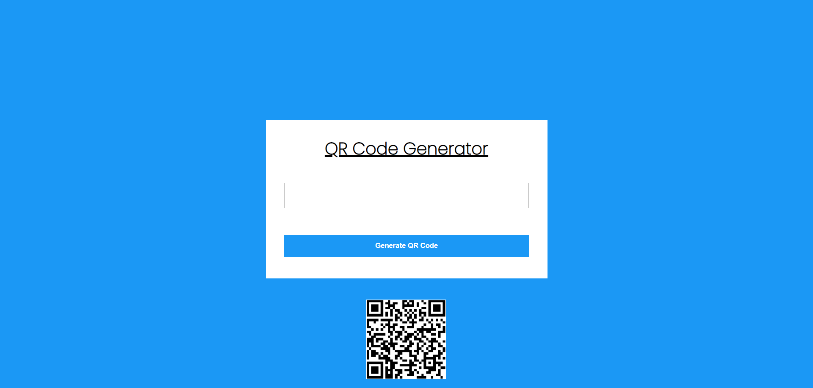

# JavaScript Project - QR Code Generator

## **Project: Generating QR Code with API**

### Concepts learned from this project:
- Learned about generating input value to QR Code using API (fetch).
- API used is qrserver API.

**Live Link :** [Deployed Link](https://js-project-qrcodegenerator.netlify.app/)
>### Preview :

